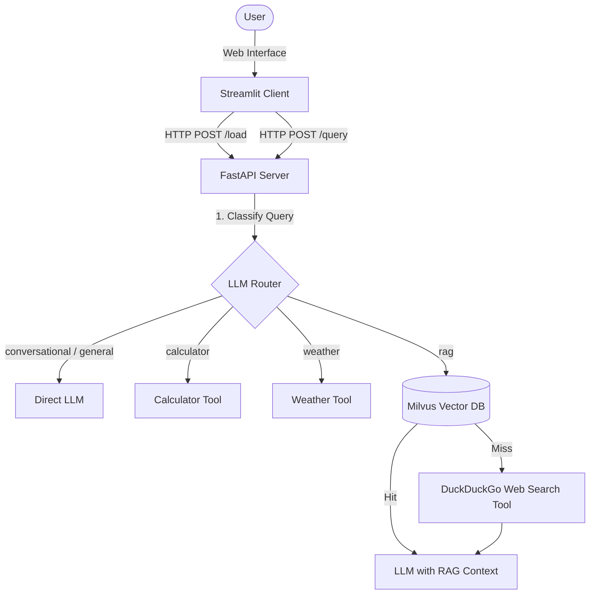

# Mini Agentic RAG Application

An agentic RAG (Retrieval-Augmented Generation) application featuring a decoupled client-server architecture, dynamic document ingestion, LLM intent-based routing, tool integration, automatic model fallbacks, and real-time execution tracing.

---

## Architecture Overview

The project is structured into two main components:
1. **FastAPI Backend (`app.py`):** Runs on port `8000`. Exposes ingestion and query endpoints, connects to the local Milvus Vector Database, runs the intent classifier, calls external APIs/tools, and manages the LLM execution pipeline.
2. **Streamlit Frontend (`main.py`):** Runs on port `8501`. Provides an interactive user interface for uploading files, scraping URLs, asking questions, and displaying glassmorphism execution trace logs.



---

## Key Features

* **LLM-Based Intent Routing:** All queries are classified by the LLM first (into greetings, calculations, weather requests, general knowledge, or document-specific RAG). General queries bypass the Vector DB completely to prevent false matches from candidates' resumes or portfolio pages.
* **Dynamic Ingestion & Advanced Chunking:** PDF documents and scraped web pages are split into overlapping `1000`-character segments with spacing parser safeguards. An intelligent segment-level verification prevents text scrambling on math-heavy pages or tables.
* **Automatic Fallback Chain:** Gemini is configured as the primary model. If Gemini fails due to rate limits (`RESOURCE_EXHAUSTED`) or network errors, it automatically falls back to a secondary model (local Llama 3.2 running via Ollama).
* **Execution Trace Panels:** Every response is rendered alongside an interactive trace card detailing retrieval status, tool/route selected, model used, fallback status, and response latency.
* **Tool Integrations:**
  - **Calculator:** Parses mathematical expressions using regex safeguards.
  - **Weather Tool:** Connects to the OpenWeatherMap API and extracts cities using semantic prepositions.
  - **Web Search:** Falls back to DuckDuckGo search to answer questions that are not present in the local database.

---

## Setup & Running

### 1. Prerequisites
* Install Python 3.10+
* Install and start [Ollama](https://ollama.com/) with `llama3.2` pulled locally:
  ```bash
  ollama run llama3.2
  ```

### 2. Installation
Clone the repository and install dependencies:
```bash
pip install fastapi uvicorn streamlit sentence-transformers pymilvus pypdf requests beautifulsoup4 duckduckgo-search
```

### 3. Environment Variables
Create a `.env` file in the root directory:
```env
GEMINI_API_KEY=your_gemini_api_key_here
OPENWEATHER_API_KEY=your_openweather_api_key_here
```

### 4. Running the Servers
1. Start the FastAPI backend:
   ```bash
   python app.py
   ```
2. Start the Streamlit frontend:
   ```bash
   streamlit run main.py
   ```
   Open your browser at `http://localhost:8501` to start querying.